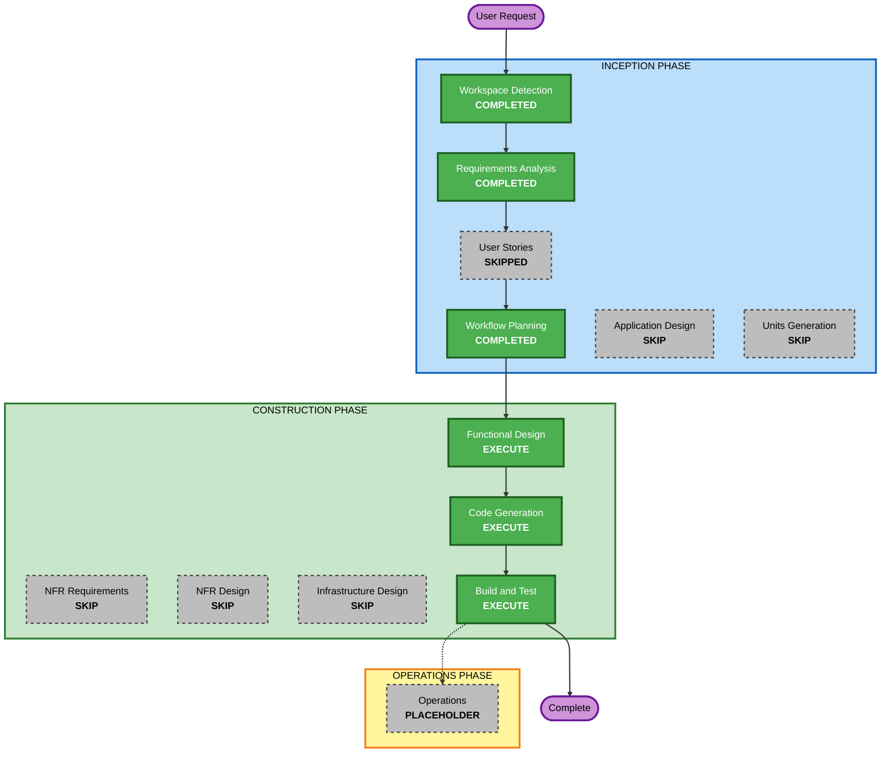

# Execution Plan — Virtual Pet (Tamagotchi)

## Detailed Analysis Summary

### Change Impact Assessment
- **User-facing changes**: Yes — the entire app is user-facing (this is a new project).
- **Structural changes**: N/A — greenfield, no existing structure to change.
- **Data model changes**: Yes — new pet state model (Hunger, Happiness, Energy, Health) and its persisted `localStorage` shape.
- **API changes**: No — no backend/API; fully client-side.
- **NFR impact**: Minimal — Security and Resiliency extensions opted out; Property-Based Testing applied partially to pure logic only.

### Risk Assessment
- **Risk Level**: Low — isolated single-page app, well-understood requirements, no external dependencies or integrations.
- **Rollback Complexity**: Easy — greenfield code, no production data or users.
- **Testing Complexity**: Simple — a handful of pure functions (decay, clamping, cooldown, save/load) plus straightforward UI.

## Workflow Visualization



### Text Alternative (always included per content-validation.md)
```
INCEPTION PHASE
- Workspace Detection: COMPLETED
- Requirements Analysis: COMPLETED
- User Stories: SKIPPED
- Workflow Planning: COMPLETED (this stage)
- Application Design: SKIP
- Units Generation: SKIP

CONSTRUCTION PHASE (single unit: virtual-pet-web-app)
- Functional Design: EXECUTE
- NFR Requirements: SKIP
- NFR Design: SKIP
- Infrastructure Design: SKIP
- Code Generation: EXECUTE
- Build and Test: EXECUTE

OPERATIONS PHASE
- Operations: PLACEHOLDER
```

## Phases to Execute

### INCEPTION PHASE
- [x] Workspace Detection (COMPLETED)
- [x] Requirements Analysis (COMPLETED)
- [x] User Stories (SKIPPED — single user type, simple/unambiguous flow, user approved skip)
- [x] Execution Plan (this document)
- [ ] Application Design — **SKIP**
  - **Rationale**: Single simple web app with one logical unit; component/service boundaries are trivial (state model + a few UI components) and are adequately covered by per-unit Functional Design in Construction. No multi-service architecture to design.
- [ ] Units Generation — **SKIP**
  - **Rationale**: This is a single, simple unit of work (one client-side web app). No decomposition into multiple units/services needed.

### CONSTRUCTION PHASE (Unit: `virtual-pet-web-app`)
- [ ] Functional Design — **EXECUTE**
  - **Rationale**: Business rules need explicit design before coding: stat decay direction/rates (Hunger inverted vs. Happiness/Energy/Health), clamping to [0,100], derived Health calculation, action cooldowns, and the `localStorage` persistence shape.
- [ ] NFR Requirements — **SKIP**
  - **Rationale**: Tech stack already determined (React + TypeScript, client-only). Security and Resiliency extensions opted out. No performance/scalability requirements beyond a simple single-user browser app.
- [ ] NFR Design — **SKIP**
  - **Rationale**: NFR Requirements skipped; no NFR patterns to incorporate.
- [ ] Infrastructure Design — **SKIP**
  - **Rationale**: No backend, no cloud resources, no deployment infrastructure — pure static client-side app.
- [ ] Code Generation — **EXECUTE (ALWAYS)**
  - **Rationale**: Implementation planning and code generation needed to produce the working app.
- [ ] Build and Test — **EXECUTE (ALWAYS)**
  - **Rationale**: Build, unit test (including Property-Based Testing for pure decay/clamping/save-load logic per opted-in scope), and verification needed.

### OPERATIONS PHASE
- [ ] Operations — **PLACEHOLDER**
  - **Rationale**: Future deployment/monitoring workflows; not applicable to a local learning project.

## Estimated Timeline
- **Total Stages Executing**: 5 (Workspace Detection, Requirements Analysis, Workflow Planning, Functional Design, Code Generation, Build and Test — 6 counting Workflow Planning itself)
- **Estimated Duration**: Single session — small, well-scoped app with no external integrations.

## Success Criteria
- **Primary Goal**: A working, browser-based Tamagotchi-style virtual pet with Feed/Play/Rest actions, time-based decay while open, and persistent state across reloads.
- **Key Deliverables**: React + TypeScript app; pet state module (decay, clamping, cooldowns, derived Health); `localStorage` persistence; simple mood-based UI; unit tests (incl. property-based tests for pure logic).
- **Quality Gates**: Requirements FR1–FR7 and NFR1–NFR5 satisfied; app builds and runs; tests pass.
