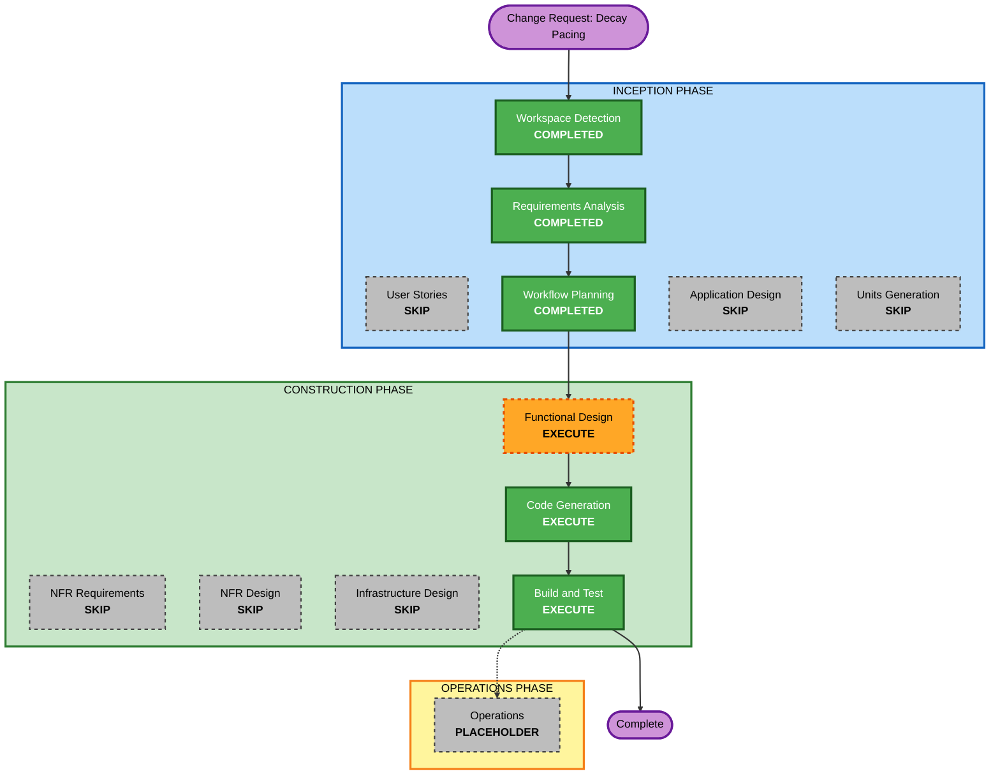

# Execution Plan — Decay Pacing ("Sudden" Feel After Feeding)

## Detailed Analysis Summary

### Change Impact Assessment
- **User-facing changes**: Yes — directly changes how decay feels moment-to-moment after Feed/Play.
- **Structural changes**: Minor — no new components; changes are internal to the existing `App` component's tick-scheduling logic and the existing domain rule functions.
- **Data model changes**: Yes — this is the first change in this series to touch `PetState`'s shape. New fields are needed to track per-stat grace-period remaining time (for Hunger after Feed, Happiness after Play). Per the existing documented convention in `domain-entities.md` ("if the shape changes later, bump to `.v2`... rather than attempting migration — acceptable for a local learning project per NFR5"), the persisted storage key should bump from `virtualPet.state.v1` to `virtualPet.state.v2`, and old saves will fall back to a fresh default pet on load — consistent with the project's own pre-approved policy, not a new decision.
- **API changes**: N/A — no backend/API surface.
- **NFR impact**: Extends existing NFRs (NFR4/NFR-RB2 tunability, adds NFR-DP2/NFR-DP3 for pacing-specific testability and versioned persistence) — no new NFR category.

### Component Relationships
- **Primary Components**: `src/App.tsx` (tick-scheduling change — restart the interval on any action), `src/domain/rules.ts` and `src/domain/constants.ts` (grace-period logic and durations), `src/domain/types.ts` (new `PetState` fields), `src/domain/constants.ts` (bump `PET_STATE_STORAGE_KEY`).
- **Dependent Components**: `src/domain/persistence.ts` — the versioned-key fallback path already exists and just needs the key bumped; no new logic required there per the existing "no migration" policy. UI components (`StatBar`, `ActionPanel`) are unaffected — they don't need to display grace-period state.
- **Supporting Components**: `tests/domain/rules.test.ts`, `tests/domain/rules.balance.test.ts` (may need timing-aware updates), a new pacing-specific test file, and `tests/App.test.tsx` if the interval-reset behavior needs coverage at that level (likely needs fake timers).

### Risk Assessment
- **Risk Level**: Medium (elevated from the prior change's Low) — this is the first change to alter the persisted data shape and the core tick-scheduling mechanism, both more structurally sensitive than a pure constants/rules retune.
- **Rollback Complexity**: Easy — plain git revert; no external state beyond the browser's own `localStorage`, and the versioned-key fallback means even a bad rollback just resets local saves, not a data-loss risk beyond this single-user local learning project's own scope (NFR5).
- **Testing Complexity**: Moderate-High — timing-dependent behavior (interval reset, grace countdowns) needs careful simulation-based tests (likely fake timers), more state transitions to verify than the previous change.

## Workflow Visualization

## Phases to Execute

### INCEPTION PHASE
- [x] Workspace Detection, Requirements Analysis, Workflow Planning (this document)
- [x] User Stories — **SKIPPED** (same rationale as the prior change: single user type, internal pacing fix, no personas needed)
- [ ] Application Design — **SKIP**
  - **Rationale**: No new components/services; the tick-scheduling and grace-period changes live inside the existing `App` and domain-rules boundary, not a new service layer.
- [ ] Units Generation — **SKIP**
  - **Rationale**: Still a single existing unit.

### CONSTRUCTION PHASE
- [ ] Functional Design — **EXECUTE**
  - **Rationale**: New domain entities (grace-tracking fields on `PetState`), a changed Tick Process (action-triggered restart), and exact grace-duration numbers (bounded below each action's cooldown, per NFR-DP1) all need to be designed before code changes.
- [ ] NFR Requirements — **SKIP**
  - **Rationale**: No new NFR category; NFR-DP2/NFR-DP3 extend existing NFR4/NFR-RB1/NFR-RB2.
- [ ] NFR Design — **SKIP** (NFR Requirements skipped)
- [ ] Infrastructure Design — **SKIP**
  - **Rationale**: Still client-side only.
- [ ] Code Generation — **EXECUTE (ALWAYS)**
- [ ] Build and Test — **EXECUTE (ALWAYS)**
  - **Note**: Build and Test for this change should include an explicit local-storage compatibility check — confirm that an old `.v1`-shaped save falls back cleanly to a fresh pet under the new `.v2` key, per the existing documented policy.

### OPERATIONS PHASE
- [ ] Operations — PLACEHOLDER

## Estimated Timeline
- **Total Stages to Execute**: 5 (Requirements Analysis, Workflow Planning, Functional Design, Code Generation, Build and Test)
- **Estimated Duration**: Single session — moderate-sized, well-scoped change

## Success Criteria
- **Primary Goal**: Feed/Play no longer feel like decay resumes "right away" — the timing is consistent (always a full tick's worth of relief minimum) and gently smoothed by a short grace period, without freezing decay or loosening the prior change's sustainability/neglect guarantees.
- **Key Deliverables**: Updated `business-logic-model.md`/`business-rules.md`/`domain-entities.md` (Functional Design), updated `src/App.tsx` + `src/domain/*` + bumped storage key (Code Generation), new/updated timing-aware tests, all existing tests still passing.
- **Quality Gates**: All unit/property/balance/pacing tests pass; `npm run build` succeeds; old `.v1` save data verified to fall back gracefully; manual/headless smoke check confirms the pacing actually feels different in the running app.
