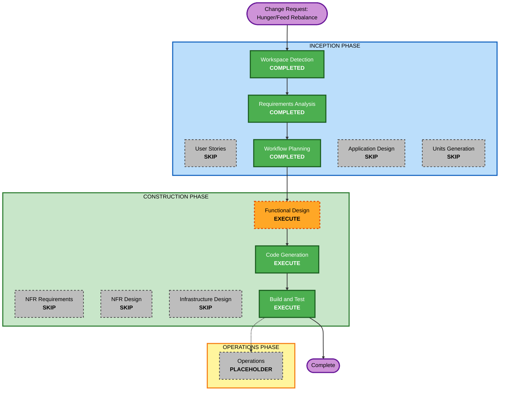

# Execution Plan — Hunger/Feed Rebalance

## Detailed Analysis Summary

### Change Impact Assessment
- **User-facing changes**: Yes — observable gameplay behavior changes (Hunger/Happiness become sustainably manageable under diligent play; Rest interaction changes); no UI markup/layout changes.
- **Structural changes**: No — no new components, no architecture change.
- **Data model changes**: No (expected) — `PetState`/`PetStats` shapes are unchanged; only constant values and decay/rule logic within existing functions are retuned. Functional Design will confirm no new state field is needed for FR-RB4 (Rest interaction), since `isResting` already exists on `PetState`.
- **API changes**: N/A — no backend/API surface (client-side only, per NFR5).
- **NFR impact**: Minor — reaffirms existing NFR4 (tunable constants) and extends the existing Property-Based Testing extension's coverage (NFR-RB1); no new NFR category introduced.

### Component Relationships
- **Primary Component**: `virtual-pet-web-app` domain logic layer — `src/domain/constants.ts`, `src/domain/rules.ts`.
- **Dependent Components**: `src/App.tsx` and UI components (`StatBar`, `ActionPanel`) consume `PetState`/`PetStats` and mood/health outputs from this layer — they read the same shapes, so no changes expected there, but Build and Test should verify the UI still renders correctly against the new numbers.
- **Supporting Components**: existing test suites (`tests/`) for `rules.ts` — will need new/updated invariant tests per NFR-RB1.

### Risk Assessment
- **Risk Level**: Low — isolated to one existing component's internal rules/constants; no architecture, data model, or API change.
- **Rollback Complexity**: Easy — plain git revert of the domain-layer changes.
- **Testing Complexity**: Moderate — the fix must satisfy explicit sustainability invariants (FR-RB1, FR-RB3) across several interacting constants, which needs deliberate multi-cycle simulation tests, not just single-value assertions.

## Workflow Visualization

## Phases to Execute

### INCEPTION PHASE
- [x] Workspace Detection (COMPLETED — existing project resumed)
- [x] Requirements Analysis (COMPLETED — `hunger-feed-rebalance-requirements.md`)
- [x] User Stories (SKIPPED — user proceeded directly; bug-fix/rebalance with clear scope, single user type, no personas or acceptance-criteria collaboration needed)
- [x] Workflow Planning (this document)
- [ ] Application Design — **SKIP**
  - **Rationale**: No new components or services; change is entirely within the existing domain logic layer's component boundary.
- [ ] Units Generation — **SKIP**
  - **Rationale**: Single existing unit (`virtual-pet-web-app`); no decomposition needed.

### CONSTRUCTION PHASE
- [ ] Functional Design — **EXECUTE**
  - **Rationale**: FR-RB1–FR-RB5 require detailed business-rule design — determining the exact combination of decay rates, action deltas, cooldowns, and thresholds that jointly satisfy the sustainability invariants (not a single obvious number change), plus specifying the Rest interaction change (FR-RB4). This updates `business-rules.md` and the per-unit functional design artifacts.
- [ ] NFR Requirements — **SKIP**
  - **Rationale**: No new NFRs; existing NFR4 (tunable constants) and the already-decided Property-Based Testing extension already cover this change's needs (NFR-RB1, NFR-RB2 are extensions of existing NFRs, not new categories).
- [ ] NFR Design — **SKIP**
  - **Rationale**: NFR Requirements skipped.
- [ ] Infrastructure Design — **SKIP**
  - **Rationale**: No infrastructure involved (client-side only, per NFR5).
- [ ] Code Generation — **EXECUTE (ALWAYS)**
  - **Rationale**: Implement the retuned constants/rules in `src/domain/constants.ts` and `src/domain/rules.ts`, plus the new invariant tests (NFR-RB1).
- [ ] Build and Test — **EXECUTE (ALWAYS)**
  - **Rationale**: Full test suite (including new balance-invariant tests) must pass; UI smoke-check that the app still behaves correctly with new numbers.

### OPERATIONS PHASE
- [ ] Operations — PLACEHOLDER (no deployment/monitoring workflow defined)

## Estimated Timeline
- **Total Stages to Execute**: 5 (Requirements Analysis, Workflow Planning, Functional Design, Code Generation, Build and Test)
- **Estimated Duration**: Single session — small, well-scoped domain-logic change

## Success Criteria
- **Primary Goal**: Diligent Feed/Play play keeps Hunger and Happiness sustainably in a safe range indefinitely, while neglect still visibly degrades the pet (FR-RB1–FR-RB5).
- **Key Deliverables**: Updated `business-rules.md` (Functional Design), updated `constants.ts`/`rules.ts` (Code Generation), new/updated invariant tests, all existing tests still passing.
- **Quality Gates**: All unit/property tests pass; new sustainability-invariant tests pass; `npm run build` succeeds; manual/headless smoke check confirms UI still reflects stats correctly.
