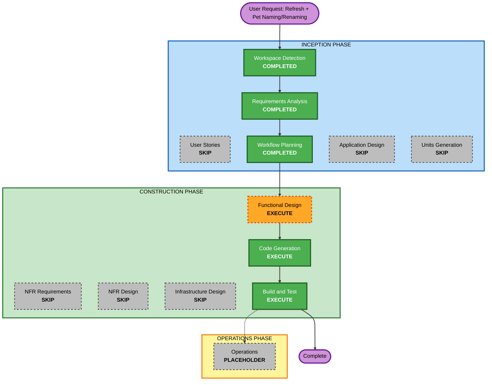

# Execution Plan — Refresh Game & Pet Naming/Renaming

## Detailed Analysis Summary

### Change Impact Assessment
- **User-facing changes**: Yes — a new Refresh control, a first-launch naming prompt, and an always-available Rename control (plus the pet's name now needs to be displayed somewhere in the UI, which it currently isn't at all).
- **Structural changes**: Minor — new frontend components within the existing `virtual-pet-web-app` unit (no new architectural component/service).
- **Data model changes**: Yes — adds `name: string` to `PetState`. Requires a storage-key version bump (`.v2` → `.v3`), following the same no-migration/fallback-to-fresh-pet pattern already established for the `.v1`→`.v2` bump in the Decay Pacing change.
- **API changes**: N/A — no backend.
- **NFR impact**: Minimal — extends existing NFR4 (tunable constants: `MAX_NAME_LENGTH`, `DEFAULT_PET_NAME`) and reuses the existing NFR5 versioned-persistence policy; no new NFR category.

### Component Relationships
- **Primary unit**: `virtual-pet-web-app` (single existing unit, unchanged)
- **Domain layer touched**: `src/domain/types.ts` (new `name` field), `factory.ts` (name on creation), `persistence.ts` (validator + key bump), `constants.ts` (new naming constants), `rules.ts` (new reset operation, name validation)
- **Frontend layer touched**: `src/App.tsx` (first-launch detection, wiring), likely new component(s) for the naming/rename dialog and the Refresh control, and `PetDisplay.tsx` needs to actually show the pet's name (currently shows only mood art — there's no name display anywhere yet)

### Risk Assessment
- **Risk Level**: Medium — second change in this series to touch the persisted data shape (after Decay Pacing's `.v1`→`.v2`), plus two new UI flows (first-launch naming, rename) that didn't exist before.
- **Rollback Complexity**: Moderate — isolated to this unit, but spans domain + persistence + multiple new UI pieces.
- **Testing Complexity**: Moderate — needs coverage for: name validation, reset-but-keep-name behavior, first-launch-only prompt detection, rename at any time, and old-shape (`.v2`) save fallback to a fresh pet.

## Workflow Visualization



### Text Alternative
```
INCEPTION PHASE
- Workspace Detection: COMPLETED (resumed)
- Requirements Analysis: COMPLETED
- User Stories: SKIP
- Workflow Planning: COMPLETED (this document)
- Application Design: SKIP
- Units Generation: SKIP

CONSTRUCTION PHASE
- Functional Design: EXECUTE
- NFR Requirements: SKIP
- NFR Design: SKIP
- Infrastructure Design: SKIP
- Code Generation: EXECUTE
- Build and Test: EXECUTE

OPERATIONS PHASE
- Operations: PLACEHOLDER
```

## Phases to Execute

### INCEPTION PHASE
- [x] Workspace Detection (COMPLETED)
- [x] Requirements Analysis (COMPLETED)
- [x] User Stories (SKIPPED)
  - **Rationale**: Single user type, requirements are already unambiguous after the clarification round; consistent with every prior change in this project.
- [x] Workflow Planning (this document)
- [ ] Application Design — **SKIP**
  - **Rationale**: No new component/service in the architectural sense — new domain functions and UI pieces stay inside the existing `virtual-pet-web-app` unit boundary.
- [ ] Units Generation — **SKIP**
  - **Rationale**: Single existing unit, no decomposition needed.

### CONSTRUCTION PHASE
- [ ] Functional Design (unit: `virtual-pet-web-app`) — **EXECUTE**
  - **Rationale**: New business logic needs designing before code: the reset operation's exact semantics (which domain function resets what, keeping name), name validation rules as a reusable function, how "first launch, no saved pet" is detected (distinct from "name happens to equal the default"), the new persisted shape (`name` field + `.v3` key bump + validator update), and where the pet's name is displayed in the UI (it isn't shown anywhere today) plus where the naming/rename dialog and Refresh control live structurally.
- [ ] NFR Requirements — **SKIP**
  - **Rationale**: Extends existing NFR4 (tunable constants) and NFR5 (versioned persistence); no new NFR category introduced.
- [ ] NFR Design — **SKIP**
  - **Rationale**: NFR Requirements skipped.
- [ ] Infrastructure Design — **SKIP**
  - **Rationale**: Client-side only, no infrastructure involved.
- [ ] Code Generation — **EXECUTE (ALWAYS)**
  - **Rationale**: Implementation of the domain changes and new UI components.
- [ ] Build and Test — **EXECUTE (ALWAYS)**
  - **Rationale**: Verify name validation edge cases, first-launch-only prompt behavior, reset-but-keep-name behavior, rename-at-any-time, and old-`.v2`-save fallback, plus a live browser smoke test (established pattern for every prior change).

### OPERATIONS PHASE
- [ ] Operations — **PLACEHOLDER**
  - **Rationale**: No deployment/monitoring workflow defined yet, unchanged from the rest of the project.

## Success Criteria
- **Primary Goal**: Players can refresh (reset) the game with one click and no confirmation, and can name their pet on first launch (or accept a default) and rename it any time afterward.
- **Key Deliverables**: Updated `src/domain/{types,constants,factory,rules,persistence}.ts`, new/updated frontend components (naming/rename UI, Refresh control, pet name now visibly displayed), updated tests, updated functional-design and build-and-test docs.
- **Quality Gates**: All existing tests continue to pass; new tests cover name validation, first-launch detection, reset-keeps-name behavior, and `.v2`→`.v3` fallback; `npm run build` succeeds; live browser smoke test confirms all three flows (name, rename, refresh) end-to-end.
